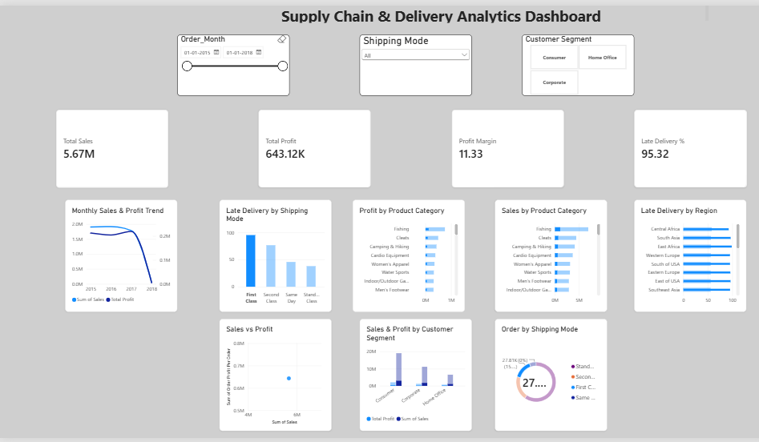

# Supply Chain & Delivery Analytics

An end-to-end data analytics project focused on understanding delivery performance, shipping operations, product performance, customer segments, and profitability using Python and Power BI.

## Overview

This project analyzes the DataCo Smart Supply Chain dataset containing 180K+ order records. The analysis was carried out to identify patterns in delivery delays and understand how shipping methods, products, regions, customer segments, and sales performance relate to overall supply chain operations.

The project includes data preprocessing and exploratory analysis in Python, along with an interactive Power BI dashboard for visual analysis.

## Dataset

**Dataset:** DataCo Smart Supply Chain Dataset

- Records: 180,519
- Original columns: 53
- Final columns after preprocessing: 51

The dataset contains information related to orders, customers, products, shipping, sales, delivery, and profit.

The raw dataset has not been included in the repository.

## Technologies

| Category | Tools |
|---|---|
| Programming | Python |
| Data Analysis | Pandas, NumPy |
| Visualization | Matplotlib, Seaborn |
| Business Intelligence | Power BI |
| Development | Jupyter Notebook |

## Data Preparation

The raw dataset was cleaned and prepared before analysis. The main steps included:

- Handling missing values
- Removing unnecessary columns
- Checking for duplicate records
- Converting date fields to datetime format
- Creating `Shipping_Delay_Days`
- Creating `Order_Month`
- Validating the processed dataset

The resulting dataset contains 180,519 records and 51 columns with no missing values or duplicate records.

## Exploratory Data Analysis

The analysis covers the following areas:

- Overall delivery performance
- Late delivery by shipping mode
- Regional delivery performance
- Product category analysis
- Customer segment analysis
- Monthly sales and profit trends
- Sales and profitability
- Relationship between sales, profit, and shipping delays

## Key Insights

- **54.83%** of orders were classified as late deliveries.
- **First Class** shipping had the highest late-delivery rate at **95.32%**, compared with **38.07%** for Standard shipping.
- **Golf Bags & Carts** had the highest late-delivery rate among product categories at **68.85%**.
- **Central Africa** had the highest regional late-delivery rate at **57.96%**.
- Total sales were approximately **$36.78M**, with total profit of approximately **$3.97M**.
- The overall profit margin was approximately **10.78%**.
- **Fishing** generated the highest total profit among the analyzed product categories.

## Power BI Dashboard

The Power BI dashboard provides an interactive view of the main supply chain metrics and trends.

### Dashboard Preview



### Dashboard Includes

- Total Sales
- Total Profit
- Profit Margin
- Late Delivery Rate
- Monthly Sales & Profit Trend
- Late Delivery by Shipping Mode
- Profit by Product Category
- Sales by Product Category
- Late Delivery by Region
- Sales & Profit by Customer Segment
- Orders by Shipping Mode
- Sales vs Profit

Interactive filters are available for:

- Order Month
- Shipping Mode
- Customer Segment

## Project Structure

```text
Supply-Chain-Delivery-Analytics/
│
├── dashboard.png
│
├── notebooks/
│   ├── 01_data_cleaning.ipynb
│   └── 02_eda.ipynb
│
├── Supply_Chain_Dashboard.pbix
│
└── README.md
